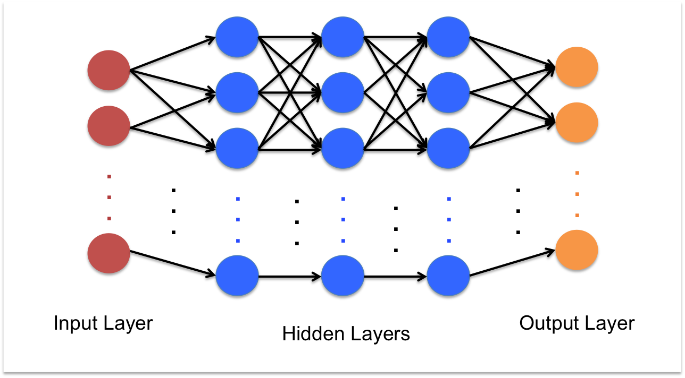

# CS205 (2015 Fall) Final Project
GPU-Deep-Neural-Network-Inference
(Hyunkwang Lee, Yohsuke Miyamoto)

## Project Aim
The purpose of this project was to implement the prediction of deep neural networks on the GPU using openCL, and perform several optimizations to speed up this operation. 

## Background and motivation
Deep neural networks (DNNs) have resurged in popularity in the past decades, and are consistently reported to yield cutting-edge performance in many fields of machine learning, such as image classification, voice recognition, natural language processing, and more.  Since neural network computations (essentially large matrix multiplications) are well-suited for parallelization, researchers often use GPUs, FPGAs, or clusters to speed up network training and prediction. Although there exist many high-performance cutting-edge software packages already implemented (such as cuBLAS to perform matrix multiplications), we chose to implement this process from scratch to understand for ourselves what aspects of parallelism can be exploited and where the bottlenecks of performance lie in neural networks.

Neural networks typically consist of 2 stages: (1) training on example data to tune their weights (learning) and (2) prediction using the trained configuration on new data (inference). For the scope of this project we choose to focus simply on step 2, the prediction step, in which we propagate the inputs through the neural network, given a set of configured weights. We focused on this component of DNN usage because DNN prediction can benefit greatly due to it being a recurring cost (in contrast to the one-time training of the network) and fast real-time predictions can be important in many applications. Furthermore, although many complex structures of DNNs exist (e.g. convolutional neural networks, recurrent neural networks) for simplicity, we focused on the simpler case of fully connected feed-forward networks.

## File Description
- ./src [Source](https://github.com/ymiyamot/GPU-Deep-Neural-Network-Inference/tree/master/docs/FILE.md)
- ./results : Generated by "./src/run_sweeps.py" with resulting reports inside
- ./plots : Included are plots that we used for presentation video and writeups
- ./docs : Included are all markdown files as well as powerpoint slides used for making the presentation video

## Analysis
- [Analysis](https://github.com/ymiyamot/GPU-Deep-Neural-Network-Inference/tree/master/docs/ANALYSIS.md)
