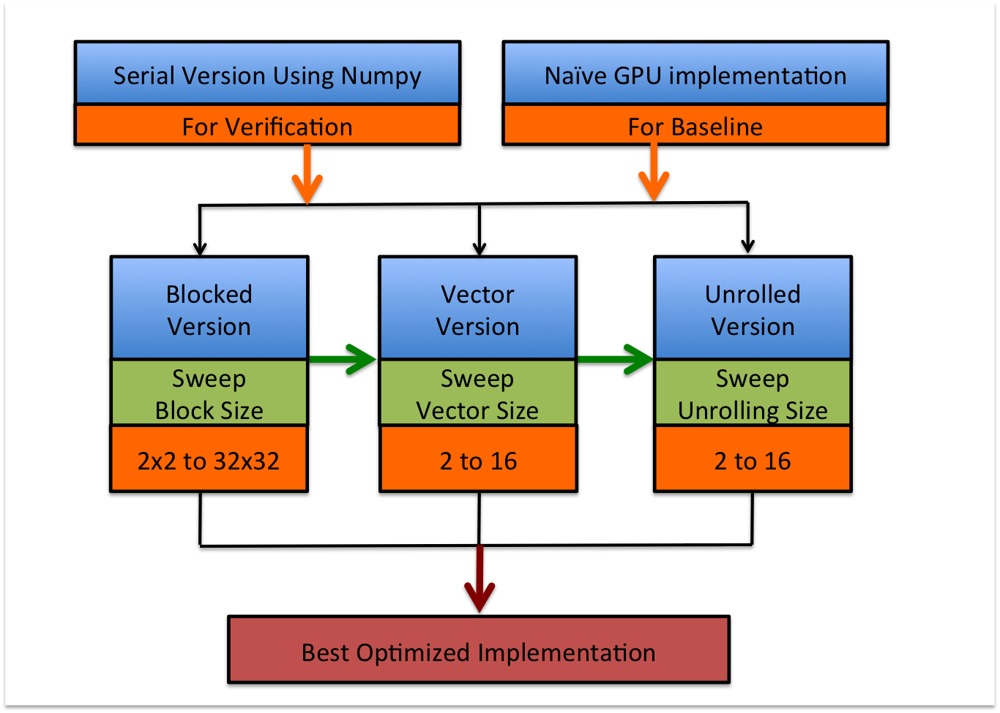
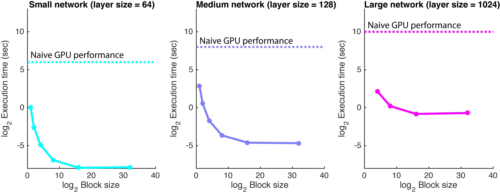
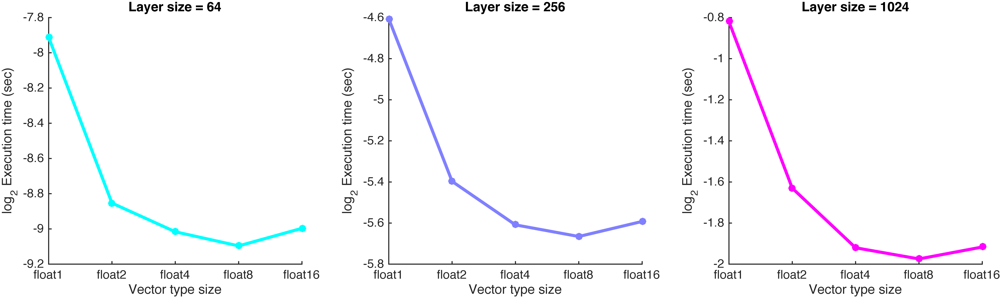
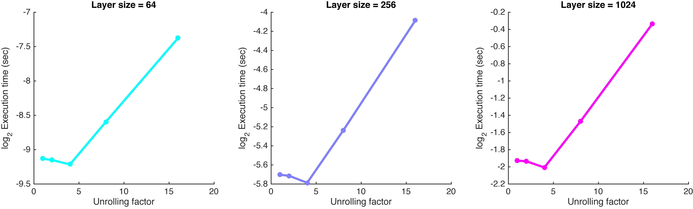
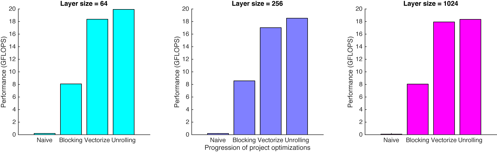

# Analysis of GPU optimizations

## Methodology

We implemented 5 versions of the DNN: a non-GPU version in numpy, a naive GPU implementation, and 3 GPU implementations optimized using different techniques (Blocking, Vectorization, Unrolling, described below). However, the performance of each of these 3 optimizations can depend on parameters that depend on various factors such as GPU specifications, number of inputs, and network architecture. Thus we compared the performance speed across different values of these parameter configurations in order to determine what configurations performed best. At each stage, we took the best configuration resulting from the optimization, and added the next optimization on top of it.

### Correctness
While implementing additional optimizations, we verified correctness of our implementations, by comparing the output of our GPU implementations with the output from a non-GPU serial version of the DNN implemented using python's numpy package.

### Structure of test network
Our test networks consisted of 5 layers: 1 input layer, 1 output layer, and 3 hidden layers in between. In order to assess the generality of our test results across different amounts of computation, we implemented 3 different size networks, small, medium, large. To do this we varied the size of each of the 3 hidden layers from 64, 256, to 1024, while fixing the size of the input and output layers to be 64. In addition, we fixed the number of inputs to be computed to be 1024. The values of the weights and inputs were drawn randomly from a normal distribution.

### Baseline speed comparison
As a baseline comparison, we implemented a very basic version of the DNN on the GPU. In this version, each worker computes a single output by computing a vector dot product (multiplying an entire row of weights by an entire input vector). This implementation did not utilize efficient use of local memory, and each worker read its values from global memory.

---
### 1. Blocked optimization (decomposing matrix multiplication into multiplications of sub-blocks)
In this blocked optimization, we divided up the weight matrix and input matrix into sub-matrices that were small enough to be stored in the local memory shared by each workgroup, where the size each workgroup was set to be the size of the sub-matrix. In contrast, recall that the naive implementation performs the matrix multiplication by distributing to each worker one column of the inputs and one row of the weights without utilizing local memory.

We varied the size of the sub-matrices (workgroup size) from 1x1 to 32x32 (square submatrices with row and column sizes being a power of 2), as we thought that this workgroup size might induce a tradeoff between how much data can be reused across workers, and the number of banks available to access the local memory (as well as less memory allocatable to single workers). In the plot below, we show the effect of block size (x-axis) on the performance runtime (y-axis). The 3 panels (& colors) show results for the 3 different size networks. We see a consistent trend where larger block size decreases runtime, but this effect saturates quickly such that there is very little benefit between block sizes 16 and 32.We think that this saturation may be due to the number of banks available to access each workgroup's local memory. The number of banks available can be thought of as the number of channels through which workers can access local memory in parallel. We believe that at block sizes around 16 and 32, the disadvantage from the shortage of  banks outweights the advantage of reusing data across workers. According to the optimum of the plot above, we fixed the block size to be 8x8 for the next stages of our optimizations.

---
### 2. Vectorized optimization (using vectortypes)
In this vectorized optimization, we utilized vectortypes such as float 2, float4, float 8, float 16 to perform the neural network matrix multiplication. These vectortypes are variables that can store multiple 32-bit floats (e.g. float 8 stores 8 floats). Operations such as addition and multiplication act simultaneously on the multiple floats of a vector type variable. 

We assume that loading a single float 4 from local memory uses a single bank (rather than 4). This means that using larger vectortypes should lead to fewer local memory reads (bank uses). Furthermore, using fewer workers allows more registers to be allocated to each worker. If there are too many workers, than multiple workers may have to share the same registers. Accordingly, the resulting plots above of execution time (y-axis) vs size of the vector types (x-axis) shows that this optimization yielded considerable speed-up from float2s up to float 8s, for all size networks.  However, the benefits of using larger vectortypes quickly saturates/decreases after float 8. We believe that this lack of benefit is due to our particular (suboptimal) implementation, in which we load only one row of a sub-matrix at a time from global to local memory. Thus, because we fixed our implementation with an 8x8 block size, we only read 8 floats of data at a time, no matter what vectortype we used – this may be wasting some of our ability to parallelize these memory reads. However, we carried on. Moving on to the next stage of our optimizations (unrolling for-loops), we fixed our implementation to use float 8s.

---
### 3. Unrolling optimization (For-loop unrolling)
In this unrolled optimization, we focused on "unrolling" the for loops that were being performed. "Unrolling" means that we make each worker will perform more operations within each iteration of the for-loop, for correspondingly fewer iterations. This has the benefit of decreasing the number of checks of loop conditions (i.e. checks performed to determine whether to move on to the next iteration). On the other hand, because there is a limited total number of registers that can be allocated, having each worker use too many registers may cause multiple workers to share the same registers, which may create waiting them.

In the plot above, we present the execution times resulting from varying the number of operations being performed within each loop (unrolling factor) from 1 (no unrolling) to 2, 4, 8, 16. It is obvious that after 4, the execution time dramatically increases, suggesting that the disadvantage of allocating too many registers to each worker quickly degrades performance. Based on the optimum of the plot above, we chose to use an unrolling factor of 4 as a result of this final optimization.

---
### 4. Summary of Results
Below we show the progression of performance improvement through our stages of optimization. We achieved dramatic speed-up compared to our naive baseline implementation. However, a more meaningful basis of comparison might be to compare our performance results to theoretical peak performance. We calculated this peak performance of the GPU to be about 600 GFLOPs; thus, our best speed-ups here really only result in a sobering ~3% of what can theoretically be achieved.  Yet another meaningful basis of comparison might be the current cutting-edge performance resulting from cuBLAS, which is the high-performing linear algebra library built on CUDA, but we leave this to future work.

